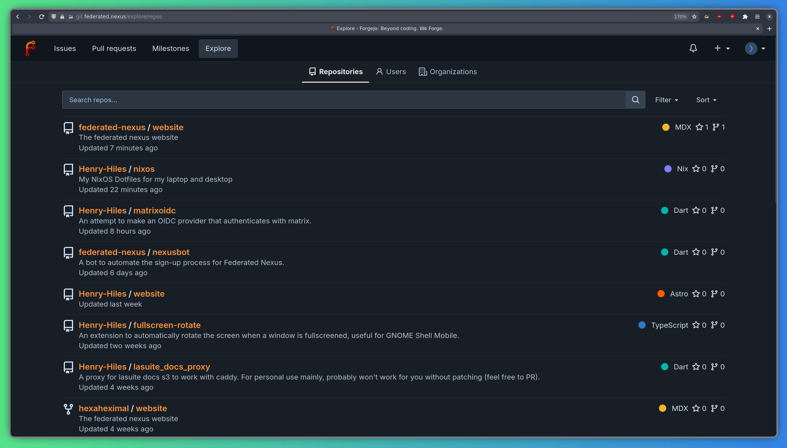
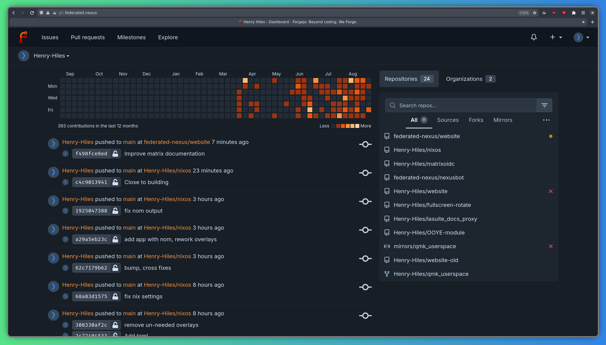

[Forgejo](https://forgejo.org) is a free and open-source software forge. Federated Nexus provides a hosted instance at https://git.federated.nexus.

## Logging in

To log in, press the "Sign in" button on the top right corner and Select "Sign in with Federated Nexus" - it should take you to the Federated Nexus login page, where you can enter the credentials for your Federated Nexus account.

You should then be greeted by the explore page:

## Viewing your dashboard

To view your dashboard, press the icon in the top left corner.

The dashboard shows you the recent activity of repositories you watch, a contribution graph, and a list of repositories you are a member of:

