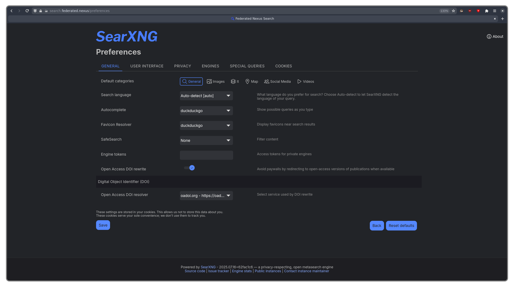

## Summary

SearXNG lets you perform fast, privacy-focused searches across the web—completely free from tracking, profiling, or intrusive advertising. SearXNG works by aggregating results from many different search engines (you can configure which ones it queries) into one page. You can find SearXNG hosted at https://search.federated.nexus.

## Settings

SearXNG is very customizable, there are many settings you can customize, including what search engines to query, the UI theme, and more.

