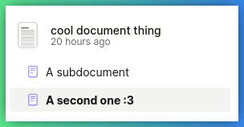

[LaSuite Docs](https://github.com/suitenumerique/docs) est un éditeur de documents libre et open source, conçu pour une collaboration en temps réel fluide. Federated Nexus fournit une instance hébergée à l'adresse https://docs.federated.nexus.

## Connexion

Sur la page d'accueil déconnectée, appuyez sur le bouton « Commencer à écrire » pour vous connecter et saisir les identifiants de votre compte Federated Nexus.

Vous devriez alors être accueilli par la page d'accueil connectée, qui affiche à la fois les documents que vous avez créés et ceux qui ont été partagés avec vous :

## Création d'un document

Sélectionnez un document pour l'ouvrir ou appuyez sur le bouton « Nouveau doc(ument) » dans le coin supérieur gauche pour créer un nouveau document.

L'éditeur de documents prend en charge les styles de texte ainsi que les images :

## Création de sous-documents

LaSuite Docs prend en charge la création de sous-documents. Pour créer un sous-document, passez la souris sur le document dans la barre latérale et appuyez sur le bouton plus.

Le sous-document devrait alors apparaître en dessous :

