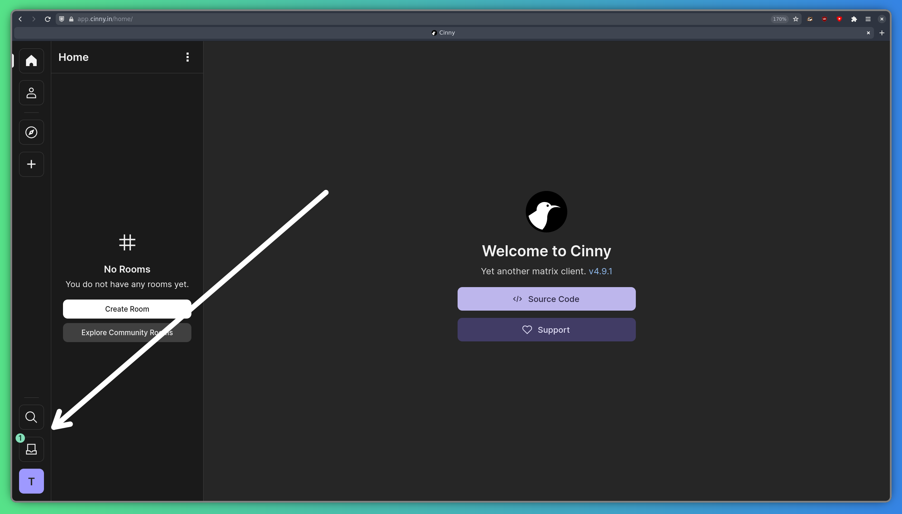

Matrix est une plateforme de communication open source qui vous permet de discuter avec les communautés de votre choix. L'une des fonctionnalités importantes de Matrix est son chiffrement de bout en bout, qui vous permet de discuter en toute confidentialité et en toute sécurité.

## Comparaison avec Discord

Matrix présente de nombreuses similitudes avec Discord, mais aussi quelques différences importantes. Cette comparaison peut vous être utile lors de la migration :

- Au lieu des « canaux » de Discord, vous disposez de « salles » Matrix. Contrairement à Discord, les salles peuvent être rejointes au sein d'un espace (expliqué ci-dessous) ou être autonomes. Elles peuvent être configurées pour fonctionner avec un chiffrement de bout en bout, mais pour les grandes salles, il est plus fiable de ne pas utiliser le chiffrement.
- L'équivalent d'un « serveur » Discord est un « espace » Matrix. Les espaces sont essentiellement un répertoire de salles, où chaque salle est regroupée sous une icône (selon votre client). Les salles au sein de l'espace sont affichées et accessibles, mais vous n'êtes pas obligé de rejoindre toutes les salles d'un espace Matrix.

## Choisir un client

Matrix est purement un protocole, et vous pouvez utiliser n'importe quel « client » de votre choix. Les clients sont des interfaces pour Matrix, et ils vous permettent de voir les messages et de rejoindre des salles. Il existe d'innombrables clients, mais nous vous recommandons l'un des suivants pour une expérience optimale :

- [Cinny](https://cinny.in) offre une interface utilisateur similaire à Discord et dispose de fonctionnalités très utiles. Vous pouvez l'utiliser sur le Web ou comme application Tauri, et il fonctionne très bien sur les téléphones Linux.
- [FluffyChat](https://fluffychat.im) est développé avec Flutter, il offre donc une excellente compatibilité multiplateforme. Il est utilisable sur iOS, Android, Linux, le Web, etc. Il dispose également de certaines fonctionnalités que Cinny n'offre pas, mais je trouve Cinny plus intuitif.

## Comment utiliser

La procédure de connexion à votre compte Federated Nexus Matrix dépend du client que vous utilisez. Je vais vous présenter ici Cinny, mais la procédure est similaire pour tous les clients.

### Ouverture de Cinny

Cinny peut être utilisé comme site web ou comme application native.  
Vous trouverez l'instance Federated Nexus ici : https://app.federated.nexus

Ou téléchargez l'application ici : https://github.com/cinnyapp/cinny-desktop/releases/latest  
Sous Linux, vous pouvez également obtenir Cinny depuis [Flathub](https://flathub.org/apps/in.cinny.Cinny) ou les référentiels de votre distribution.

### Connexion

Tout d'abord, assurez-vous que `federated.nexus` est défini comme votre « Homeserver » (serveur domestique). Le champ s'affiche sous forme de liste déroulante sur le bureau, mais vous devez le saisir manuellement.

Ensuite, entrez simplement votre nom d'utilisateur et votre mot de passe, puis cliquez sur « Se connecter » !

### Rejoindre la salle communautaire

Après vous être connecté, vous devriez voir une notification dans votre boîte de réception, dans le coin inférieur gauche de votre écran :

Cliquez sur la notification pour accéder à la page des invitations. Cliquez sur « Public », à côté de la notification.

À partir de là, acceptez l'invitation à rejoindre la salle « Federated Nexus Community », et vous êtes prêt(e) à commencer !

## Homeserver (Serveur domestique)

Federated Nexus utilise la [Continuwuity](https://continuwuity.org/), une implémentation Rust de la spécification Matrix. Cela signifie qu'il ne dispose pas de toutes les fonctionnalités de [Synapse](https://element-hq.github.io/synapse/latest/), mais qu'il est beaucoup plus performant. Voici quelques fonctionnalités qui font défaut à Grapevine :

- Salles antérieures à la version v3 : dans Matrix, chaque salle suit une certaine version des spécifications Matrix. Continuwuity prend actuellement en charge les versions v3 à v12, qui couvrent la grande majorité des salles. La version v2 est très ancienne et ne devrait plus être utilisée, mais certaines salles l'utilisent encore. Avec Federated Nexus, vous ne pourrez pas rejoindre ces salles, désolé.

## Ponts (Bridges)

Federated Nexus héberge plusieurs « ponts » et « marionnettes » pour vous permettre de communiquer avec des personnes sur d'autres plateformes depuis Matrix :

- [Out of Your Element](https://gitdab.com/cadence/out-of-your-element) (OOYE, pont Discord) : vous pouvez contrôler OOYE via son interface utilisateur web : https://ooye.federated.nexus. À partir de cette interface web intuitive, les administrateurs du serveur Discord peuvent se connecter à leur compte Discord et configurer facilement un espace Matrix ponté à l'aide de l'option « Mode facile ». Les utilisateurs plus avancés peuvent également utiliser l'option « Self-service » pour contrôler manuellement le pont, plutôt que de créer un tout nouvel espace Matrix.
- [mautrix-gmessages](https://docs.mau.fi/bridges/go/gmessages/index.html) (Marionnette SMS) : Vous pouvez utiliser mautrix-gmessages pour relier les conversations SMS à Matrix, y compris pour lire et envoyer des SMS. Vous pouvez le configurer vous-même en suivant [leurs instructions](https://docs.mau.fi/bridges/go/gmessages/authentication.html).
- [mautrix-whatsapp](https://docs.mau.fi/bridges/go/whatsapp/index.html) (WhatsApp marionnette) : Avec mautrix-whatsapp, vous pouvez relier vos discussions WhatsApp à Matrix, de manière très similaire au pont SMS. Consultez [leurs instructions](https://docs.mau.fi/bridges/go/whatsapp/authentication.html) pour configurer ça.

## Authentification

[Matrix](https://matrix.org) est le centre du système Federated Nexus, tout le reste s'authentifie via Matrix. Cela signifie que lorsque vous modifiez votre mot de passe sur Matrix, vous devrez vous connecter à tous les autres services avec le nouveau mot de passe.
