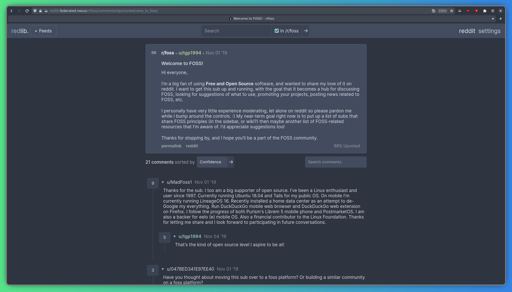

[Redlib](https://github.com/redlib-org/redlib) est une interface rapide, open source et respectueuse de la vie privée pour Reddit. Elle vous permet de parcourir les subreddits, de consulter les publications et de lire les commentaires, le tout sans JavaScript, sans suivi et sans publicité. Contrairement au site officiel de Reddit, Redlib ne vous oblige pas à vous connecter, à installer une application ou à accepter les cookies. Vous pouvez accéder à notre instance à l'adresse https://redlib.federated.nexus.

## Caractéristiques

Redlib offre un moyen propre, rapide et privé de naviguer sur Reddit. Il prend en charge de nombreux thèmes et paramètres, fonctionne aussi bien sur ordinateur que sur mobile, et permet de consulter facilement les publications, de prévisualiser les médias et de lire les fils de commentaires sans aucune publicité, aucun suivi ni JavaScript.

## Redirection automatique

Si vous souhaitez utiliser automatiquement Redlib chaque fois que vous visitez Reddit, vous pouvez installer l'extension de navigateur [LibRedirect](https://libredirect.github.io). LibRedirect détecte lorsque vous ouvrez un site tel que reddit.com et vous redirige vers une alternative respectueuse de la vie privée, qui dans ce cas est notre instance Redlib.

Une fois installé, ouvrez simplement les paramètres LibRedirect, sélectionnez « Reddit » dans le menu déroulant Service, puis sélectionnez « Redlib » dans le menu déroulant « Frontend ». Ensuite, sous « Ajouter vos instances préférées », entrez `https://redlib.federated.nexus`, puis cliquez sur « + ». Et voilà, c'est terminé !

