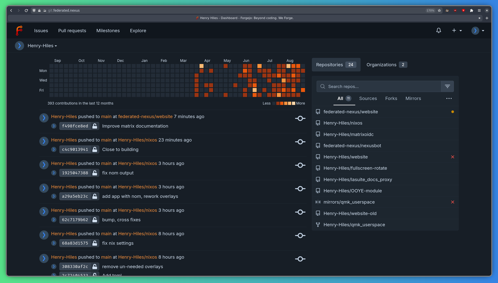

[Forgejo](https://forgejo.org)— это бесплатный git-forge с открытым исходным кодом. Forgejo — очень лёгкий и производительный инструмент, который может стать хорошей альтернативой GitHub. Мы размещаем Forgejo по адресу: https://git.federated.nexus.

## Вход в систему

Чтобы войти в систему, нажмите кнопку «Войти» в правом верхнем углу и выберите «Войти с помощью Federated Nexus» — вы перейдёте на страницу входа в Federated Nexus, где сможете ввести данные своей учётной записи.

Затем вы должны увидеть заглавную страницу:

## Просмотр вашей панели управления

Чтобы просмотреть панель управления, нажмите значок в верхнем левом углу.

На панели инструментов отображаются последние действия в репозиториях, за которыми вы следите, график участия и список репозиториев, в которых вы участвуете:

## Следующие шаги

Мы рекомендуем ознакомиться с [Руководством пользователя Forgejo](https://forgejo.org/docs/v12.0/user/) для получения более подробной информации об использовании вашей учётной записи.

Forgejo имеет множество полезных функций, например:

- Наблюдение за репозиториями, чтобы получать уведомления о любой активности в них
- Создание вилок репозиториев
- Отслеживание проблем
- API, который позволяет выполнять автоматические действия над репозиториями (например, комментировать результаты тестирования в pull-запросах).
