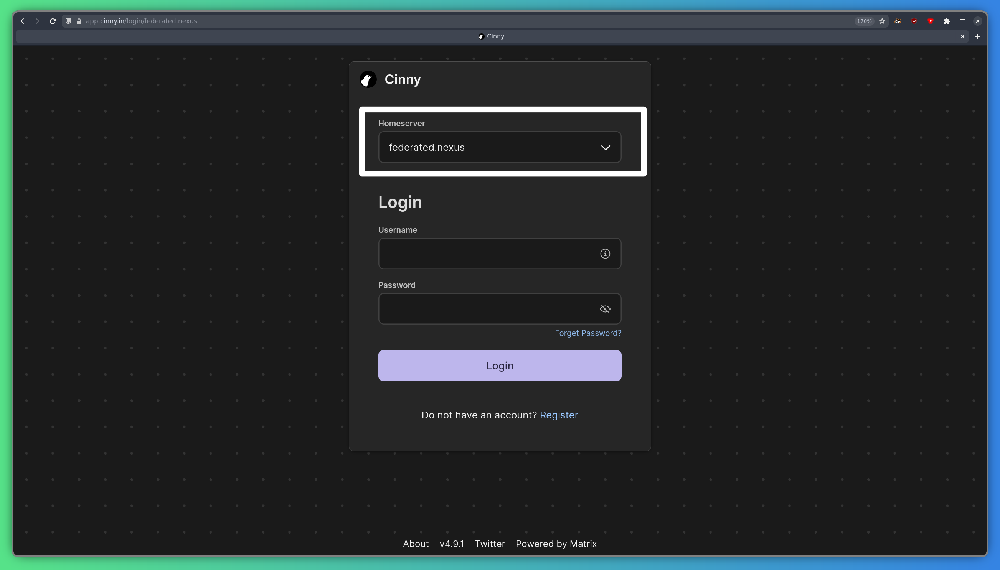
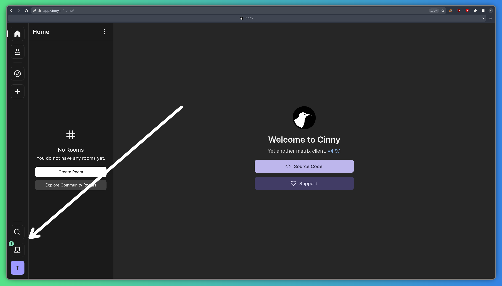
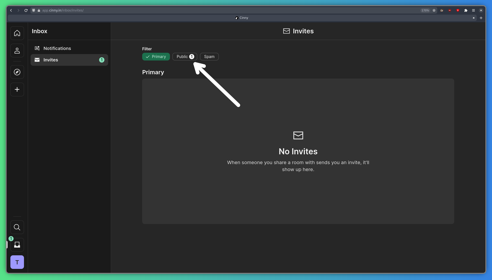
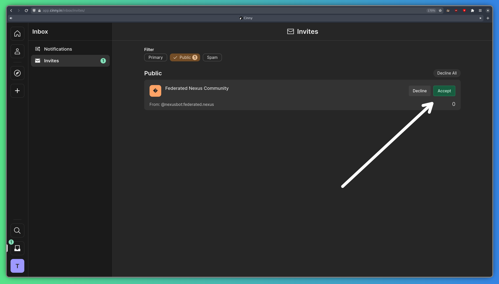

Matrix — это платформа для общения, с открытым исходным кодом, позволяющая общаться в выбранных вами сообществах. Важной особенностью Matrix является сквозное шифрование, позволяющее общаться конфиденциально и безопасно.

## Сравнение с Discord

Matrix имеет много общего с Discord, но также и некоторые важные отличия. Это сравнение может быть полезно при переходе:

- Вместо «каналов» Discord у вас есть «комнаты» Matrix. В отличие от Discord, комнаты могут быть как входящими в пространство (объясняется ниже), так и автономными. Их можно настроить для работы с сквозным шифрованием, но для больших комнат более надёжно не использовать шифрование.
- Эквивалентом «сервера» Discord является «пространство» Matrix. Пространства представляют собой каталог комнат, где каждая комната сгруппирована под одним значком (в зависимости от вашего клиента). Комнаты в пространстве отображаются и доступны для входа, однако вы не обязаны входить во все комнаты в пространстве Matrix.

## Выбор клиента

Matrix — это просто протокол, и вы можете использовать любой «клиент», который захотите. Клиенты — это интерфейсы для Matrix, с помощью которых вы можете просматривать сообщения и присоединяться к чатам. Существует бесчисленное множество клиентов, но для наилучшего результата мы рекомендуем один из следующих:

- [Cinny](https://cinny.in) предоставляет интерфейс, похожий на Discord, и имеет несколько действительно полезных функций. Вы можете использовать его в веб-браузере или как приложение Tauri, и он очень хорошо работает на телефонах с Linux.
- [FluffyChat](https://fluffychat.im) создан с помощью Flutter, поэтому имеет отличную кроссплатформенную поддержку. Его можно использовать на iOS, Android, Linux, в веб-браузерах и т. д. Он также имеет некоторые функции, которых нет в Cinny, но я считаю Cinny более интуитивным.

## Как использовать

Процесс входа в вашу учетную запись Federated Nexus Matrix зависит от того, какой клиент вы используете. Здесь я покажу Cinny, но процесс не сильно отличается в разных клиентах.

### Использование Cinny

Cinny можно использовать как веб-сайт или как штатное приложение.  
Вы можете найти экземпляр Federated Nexus здесь: https://app.federated.nexus

Или загрузить приложение отсюда: https://github.com/cinnyapp/cinny-desktop/releases/latest  
В Linux вы также можете получить Cinny из [Flathub](https://flathub.org/apps/in.cinny.Cinny) или репозиториев вашего дистрибутива.

### Вход

Прежде всего, убедитесь, что `federated.nexus` установлен в качестве вашего «Homeserver» (Домашнего сервера). Это поле отображается в виде раскрывающегося списка на рабочем столе, но вам необходимо заполнить его вручную.

Потом просто введите свои имя пользователя и пароль и нажмите «Войти»!

### Присоединение к комнате сообщества

После входа в систему вы должны увидеть уведомление в папке «Входящие» в левом нижнем углу экрана:

Нажмите на уведомление, и вы окажетесь на странице приглашений. Нажмите «Публичный», рядом с которым находится уведомление.

Там примите приглашение в комнату "Federated Nexus Community" и готово!

## Homeserver (домашний сервер)

Federated Nexus использует [Continuwuity](https://continuwuity.org/), реализацию спецификации Matrix на языке Rust. Это означает, что он не обладает всеми функциями [Synapse](https://element-hq.github.io/synapse/latest/), но гораздо более производителен. Некоторые функции, которых нет в Grapevine, включают:

- Комнаты старше v3: В Matrix каждая комната соответствует определенной версии спецификации Matrix. Continuwuity в настоящее время поддерживает версии комнат от v3 до v12, что охватывает подавляющее большинство комнат. Версия комнаты v2 является очень старой и не должна использоваться, но некоторые комнаты всё ещё её используют. С Federated Nexus вы не сможете присоединиться к этим комнатам, извините.

## Мосты

Federated Nexus поддерживает несколько «марионеток», чтобы вы могли общаться с людьми на других платформах из Matrix:

- [mautrix-gmessages](https://docs.mau.fi/bridges/go/gmessages/index.html) (SMS-марионетка): Вы можете использовать mautrix-gmessages для переноса SMS-чатов в Matrix, включая как чтение, так и отправку SMS. Вы можете настроить его самостоятельно, следуя [их инструкциям](https://docs.mau.fi/bridges/go/gmessages/authentication.html).
- [mautrix-whatsapp](https://docs.mau.fi/bridges/go/whatsapp/index.html) (WhatsApp-марионетка): С помощью mautrix-whatsapp вы можете подключить свои чаты WhatsApp к Matrix, очень похожим образом, как и в случае с SMS-мостом. Инструкции по настройке см. [здесь](https://docs.mau.fi/bridges/go/whatsapp/authentication.html).

## Аутентификация

[Matrix](https://matrix.org) - центр Federated Nexus, всё остальное проходит аутентификацию через Matrix. Это означает, что при смене пароля в Matrix вам нужно будет войти во все остальные системы с новым паролем.
