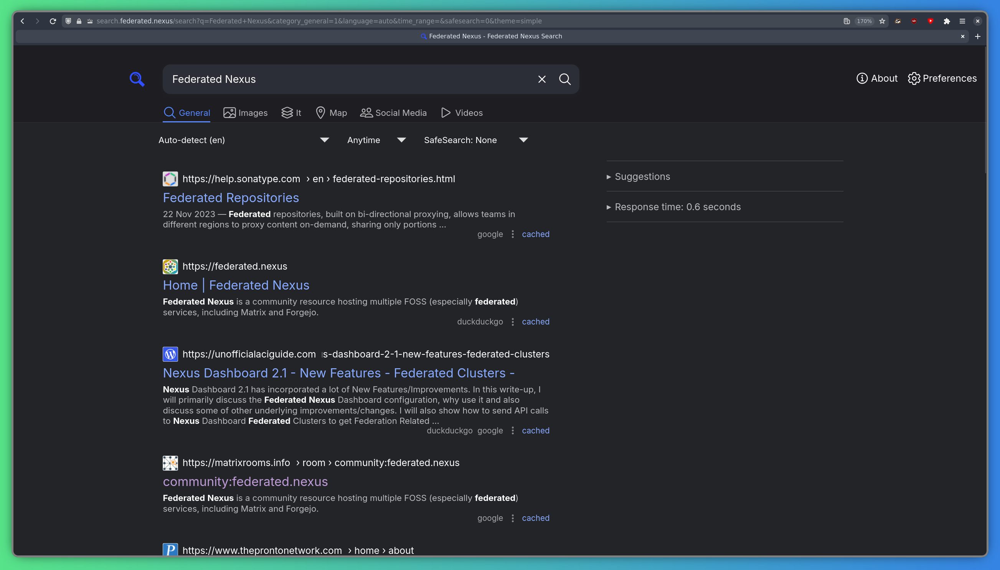
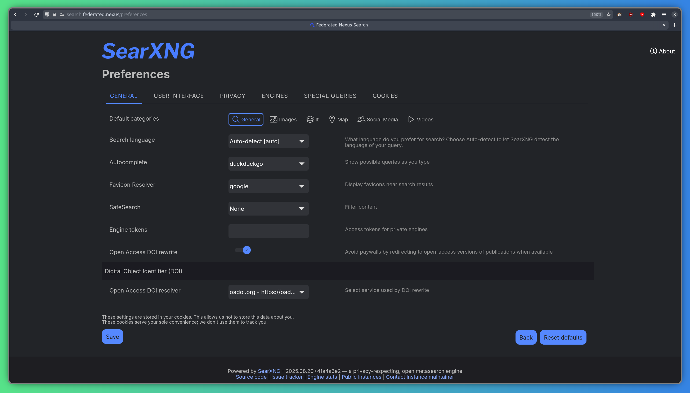

[SearXNG](https://searxng.org) позволяет выполнять быстрый поиск в Интернете с упором на конфиденциальность — без отслеживания, профилирования или навязчивой рекламы. SearXNG агрегирует результаты из многих поисковых систем (вы можете настроить, какие из них будут запрашиваться) на одной странице. SearXNG доступен по адресу: https://search.federated.nexus.

## Настройки

SearXNG очень настраиваемый, есть много настроек, которые вы можете задать, включая поисковые системы, тему интерфейса и многое другое.

