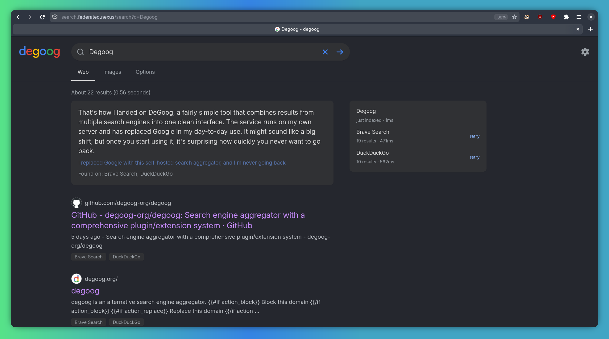

[Degoog](https://github.com/degoog-org/degoog) lets you perform fast, privacy-focused searches across the web—completely free from tracking, profiling, or intrusive advertising. Degoog works by aggregating results from many different search engines (you can configure which ones it queries in the [settings](https://search.federated.nexus/settings)) into one page. You can find Degoog hosted at https://search.federated.nexus.

