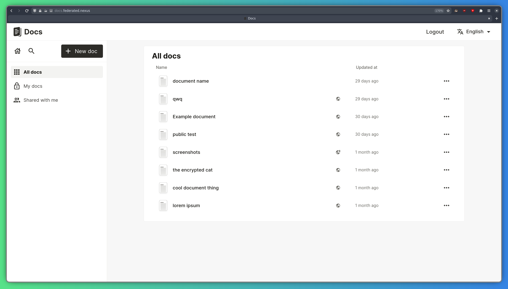
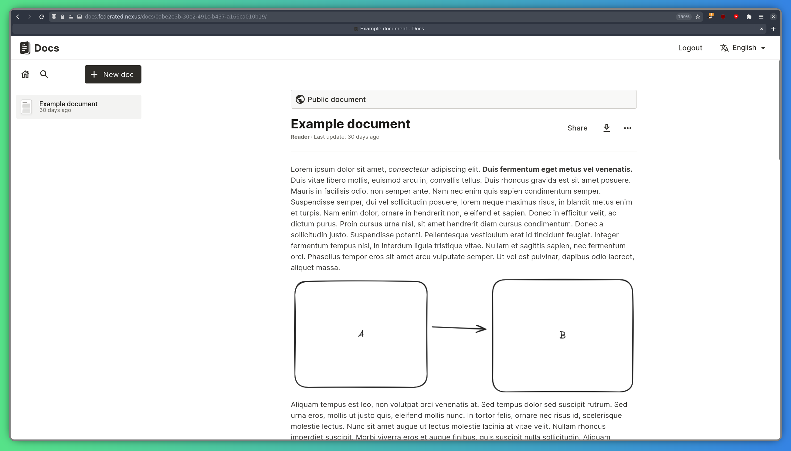
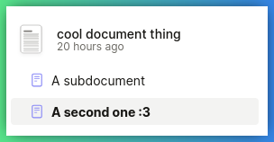

[LaSuite Docs](https://github.com/suitenumerique/docs) — це вільний редактор документів з відкритим кодом, призначений для безшовної співпраці в режимі реального часу. Federated Nexus надає свій примірник за адресою: https://docs.federated.nexus.

## Вхід

На головній сторінці, коли вхід ще не виконано, натисніть кнопку «Почати писати», щоб увійти до систему та ввести дані вашого облікового запису Federated Nexus.

Після цього ви маєте побачити сторінку входу до системи, а за нею ту, де відображаються як створені вами документи, так і документи, якими з вами поділилися:

## Початок роботи з документом

Виберіть документ, щоб відкрити його, або натисніть кнопку «Новий документ» у верхньому лівому куті, щоб створити новий.

Редактор документів підтримує форматування тексту, а також зображення:

## Створення вкладених документів

LaSuite Docs підтримує створення вкладених документів. Щоб створити такий документ, наведіть вказівник миші на документ у бічній панелі та натисніть кнопку «плюс».

Після цього ви побачите під ним вкладений документ:

