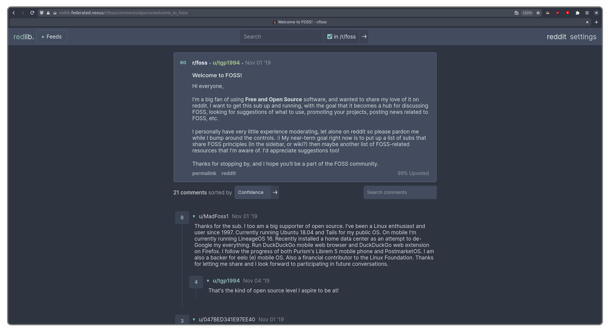
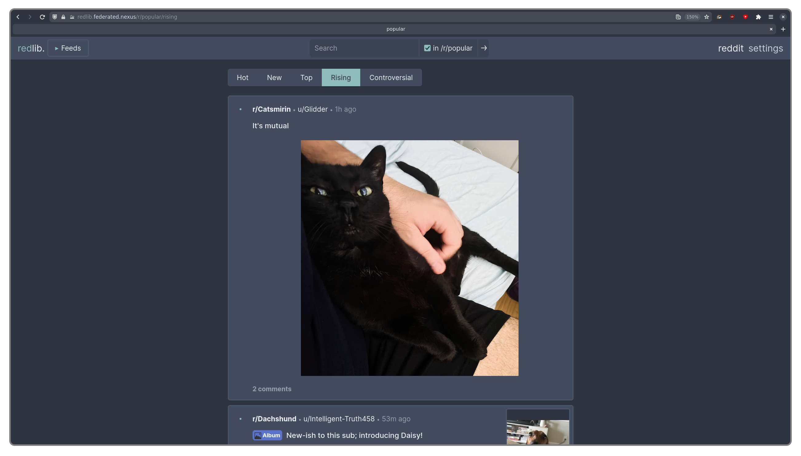
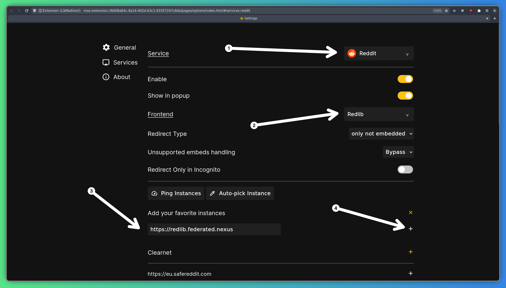

[Redlib](https://github.com/redlib-org/redlib) — це швидкий, відкритий, конфіденційний інтерфейс для Reddit. Він дозволяє переглядати субреддити, публікації та коментарі без JavaScript, відстеження або реклами. На відміну від офіційного сайту Reddit, Redlib не вимагає входу до системи, встановлення додатка або прийняття файлів cookie. Ви можете отримати доступ до нашого примірника за адресою: https://redlib.federated.nexus.

## Особливості

Redlib забезпечує чистий, швидкий і приватний спосіб перегляду Reddit. Він підтримує безліч тем і налаштувань, добре працює як на настільних комп'ютерах, так і на мобільних пристроях, а також дозволяє легко переглядати публікації, попередньо переглядати медіафайли та читати коментарі без реклами, відстеження або JavaScript.

## Автоматичне перенаправлення

Якщо ви хочете автоматично використовувати Redlib при кожному відвідуванні Reddit, ви можете встановити розширення для браузера [LibRedirect](https://libredirect.github.io). LibRedirect виявляє, коли ви відкриваєте сайт, такий як reddit.com, і перенаправляє вас на альтернативний сайт, що поважає конфіденційність, яким у цьому випадку є наш примірник Redlib.

Після встановлення просто відкрийте налаштування LibRedirect, виберіть «Reddit» у випадаючому меню «Service» та виберіть «Redlib» у випадаючому меню «Frontend». Потім у розділі «Add your favorite instances» введіть `https://redlib.federated.nexus` та натисніть «+». Ось і все, готово!

